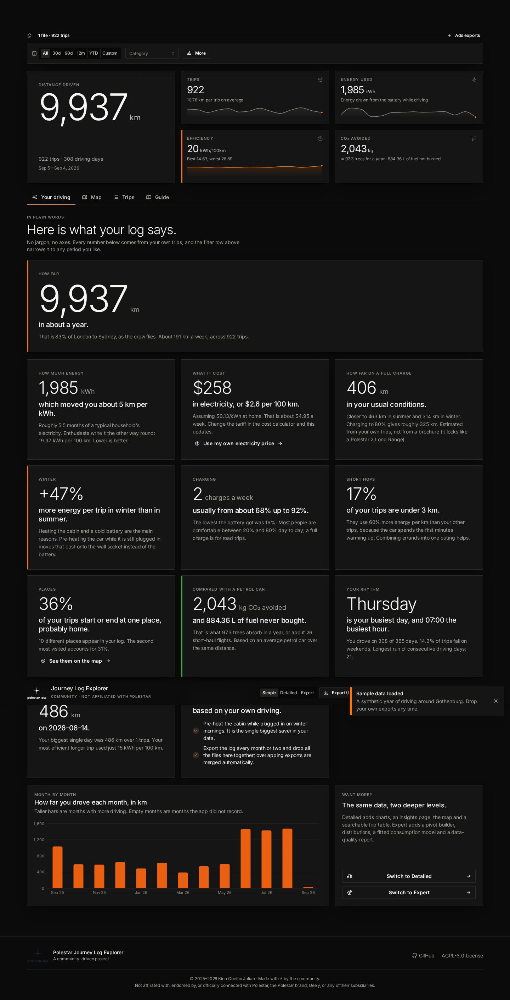
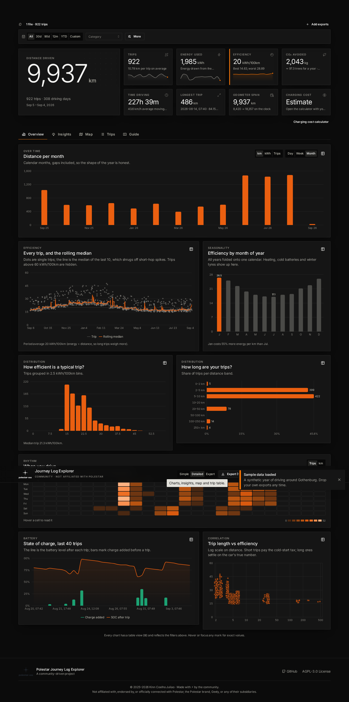
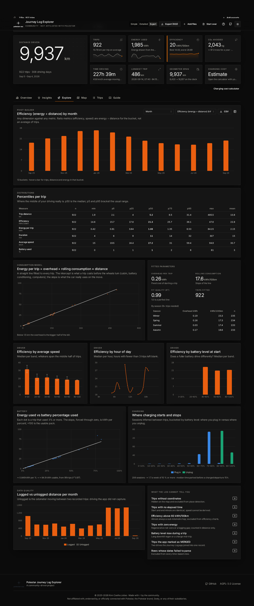
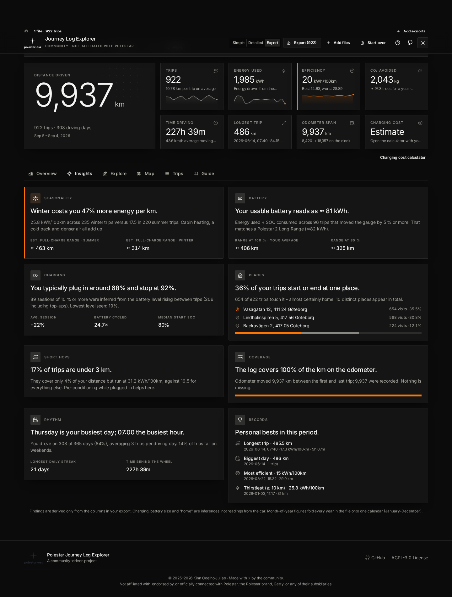
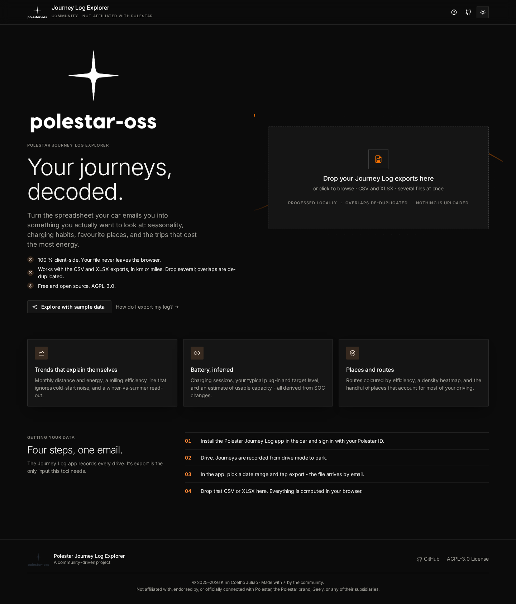
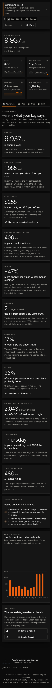

# Polestar Journey Log Explorer

<p align="center"></p>

[](https://github.com/Polestar-OSS/polestar-journey-log-explorer/actions/workflows/deploy.yml)
[](https://github.com/Polestar-OSS/polestar-journey-log-explorer/actions/workflows/dependabot/dependabot-updates)
[](https://github.com/Polestar-OSS/polestar-journey-log-explorer/actions/workflows/github-code-scanning/codeql)
[](./LICENSE)

An interactive web-based dashboard for analyzing your Polestar journey log data. Upload your CSV/Excel files and explore comprehensive statistics, visualizations, and insights about your electric vehicle trips—all processed locally in your browser with complete privacy.

## ✨ What it does

**Three depths of the same data.** A persisted *Simple · Detailed · Expert* switch in the header.

| Level | For | You get |
|---|---|---|
| **Simple** | anyone | One page in plain words: how far, how much energy (and km per kWh), what it cost at your tariff, range on a full charge in summer and winter, what winter costs you, how you charge, where you go, CO₂ vs a petrol car, your rhythm, your records, three tips from your own numbers |
| **Detailed** | owners who like charts | Overview (distance per day/week/month, efficiency with a rolling median, month-of-year seasonality, distributions, weekday × hour heatmap, battery timeline, trip length vs efficiency), an Insights page, the full KPI row with deltas vs the previous period |
| **Expert** | enthusiasts and analysts | Explore tab: pivot builder (14 dimensions × 13 metrics, CSV), percentile tables, a fitted consumption model (fixed cost per trip + rolling consumption, per season), efficiency by speed / hour / starting battery level, a battery fit (kWh per % → usable pack), charging start/stop profile, data-quality report; extra columns in the trip table |

**Several files, one journey.** Drop many exports at once or add more later. Overlapping trips are counted once (identity: start time, end time, distance), km and mile exports are normalised, and a sources bar shows rows / added / duplicates per file.

**Inference, stated as such.** Charging sessions, usable battery size, "home", winter penalty and unlogged distance are derived from the columns in the export; every card says how. All formulas are in [`docs/ANALYTICS.md`](./docs/ANALYTICS.md).

**Design.** Polestar-adjacent: monochrome surfaces, one warm accent, sharp corners, hairline borders, light display type (Inter, bundled). Dark and light. Charts follow one-axis / thin-mark / table-twin rules with a colour-vision-validated palette. Motion respects `prefers-reduced-motion`. Works at phone width.

**Private.** 100 % client-side. Files never leave the browser. A synthetic sample lets you explore without uploading anything.

## 📸 Screenshots

Rendered from the built-in synthetic sample (no real data).

| Simple | Detailed |
|---|---|
|  |  |

| Expert · Explore | Insights |
|---|---|
|  |  |

| Landing | Light theme | Mobile |
|---|---|---|
|  |  |  |

## 🚀 Quick Start

### Try It Online

Visit the live demo: **[https://polestar-oss.github.io/polestar-journey-log-explorer/](https://polestar-oss.github.io/polestar-journey-log-explorer/)**

1. Download your journey log from your Polestar app
2. Visit the website and upload your CSV/XLSX file
3. Explore your data with interactive charts and maps

### Local Development

```bash
git clone https://github.com/Polestar-OSS/polestar-journey-log-explorer.git
cd polestar-journey-log-explorer
make install   # npm ci in ./app (Node 20.19+ / 22.12+)
make dev       # http://localhost:5173/polestar-journey-log-explorer/
make check     # lint + test + build, the pull-request gate
```

Click **Explore with sample data** to load a synthetic year of driving.

## 📖 Documentation

- [User guide](./docs/USER_GUIDE.md) · [Quick start](./docs/QUICKSTART.md)
- [Analytics reference](./docs/ANALYTICS.md): every formula behind every number
- [Architecture](./docs/ARCHITECTURE.md) · [Data model](./docs/DATA_MODEL.md) · [Design system](./docs/DESIGN_SYSTEM.md)
- [Development](./docs/DEVELOPMENT.md) · [Testing](./docs/TESTING.md) · [Contributing](./docs/CONTRIBUTING.md)
- [Architecture decision records](./docs/adr/README.md)

## 🎯 Use Cases

- **Track Your Carbon Footprint** - Quantify your environmental impact
- **Optimize Charging Costs** - Understand and reduce electricity expenses
- **Analyze Driving Patterns** - Improve efficiency and range
- **Plan Road Trips** - Review past routes and consumption
- **Monitor Battery Health** - Track SOC patterns over time
- **Export Reports** - Download filtered data for external analysis

## 🗂️ Repository layout

```
app/        React application (Vite)        docs/       documentation and ADRs
tests/      unit suites and fixtures        .github/    CI, deploy, Dependabot
Makefile    install · dev · lint · test · build · audit · check · screenshots
```

## 🛠️ Tech Stack

- **React 18** - UI framework
- **Vite** - Build tool and dev server
- **Mantine UI** - Component library
- **OpenLayers** - Interactive maps (CARTO / OpenStreetMap tiles)
- **Recharts** - Data visualization
- **PapaParse / ExcelJS** - CSV and XLSX parsing (ExcelJS is loaded on demand)
- **Inter Variable** - Bundled typeface

## 📦 Data Format

The application supports CSV and XLSX files with these columns:
- Start/End Date & Time
- Start/End Address
- Distance (km or mi; the header decides the unit)
- Consumption (kWh)
- Efficiency is derived (kWh per 100 km or mi)
- SOC (State of Charge)
- Odometer readings

See the [User Guide](./docs/USER_GUIDE.md) for detailed data format specifications.

## 🤝 Contributing

Contributions are welcome! Please read our [Contributing Guide](./docs/CONTRIBUTING.md) for details on our code of conduct and the process for submitting pull requests.

## 📄 License

This project is licensed under the GNU Affero General Public License v3.0 - see the [LICENSE](./LICENSE) file for details.

Copyright (c) 2025 Kinn Coelho Juliao <kinncj@gmail.com>

## 🙏 Acknowledgments

- Polestar for creating amazing electric vehicles
- The open-source community for the excellent libraries used in this project
- All contributors who help improve this tool

## ⚠️ Disclaimer

**This is a community-driven project and is not affiliated with, endorsed by, or in any way officially connected with Polestar, the Polestar brand, Geely, or any of their subsidiaries or affiliates.**

This tool is created by the community for analyzing journey log data exported from Polestar vehicles. All trademarks, logos, and brand names are the property of their respective owners.

## 📞 Support

- **Issues**: [GitHub Issues](https://github.com/polestar-oss/polestar-journey-log-explorer/issues)
- **Discussions**: [GitHub Discussions](https://github.com/polestar-oss/polestar-journey-log-explorer/discussions)

---

Made with ⚡ for Polestar drivers
