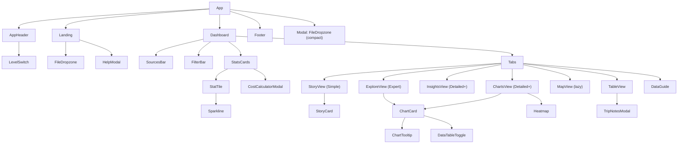

# Component hierarchy

Shared primitives: `Eyebrow`, `DeltaBadge`, `ChartCard`, `ChartTooltip`,
`DataTable`, `Sparkline`. Every chart in every level is composed from the
same three chart pieces so the look cannot drift.
