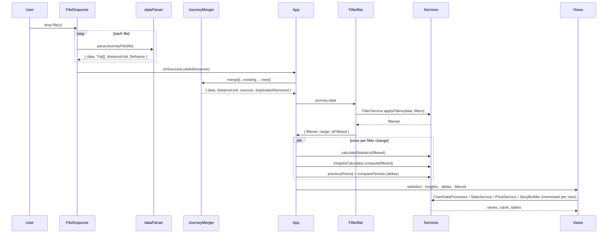

# Data flow

```mermaid
sequenceDiagram
    participant U as User
    participant D as FileDropzone
    participant P as dataParser
    participant M as JourneyMerger
    participant A as App
    participant F as FilterBar
    participant S as Services
    participant V as Views

    U->>D: drop file(s)
    loop each file
        D->>P: parseJourneyFile(file)
        P-->>D: { data: Trip[], distanceUnit, fileName }
    end
    D->>A: onSourcesLoaded(sources)
    A->>M: merge([...existing, ...new])
    M-->>A: { data, distanceUnit, sources, duplicatesRemoved }
    A->>F: journey.data
    F->>S: FilterService.applyFilters(data, filters)
    S-->>F: filtered
    F->>A: { filtered, range, isFiltered }
    par once per filter change
        A->>S: calculateStatistics(filtered)
        A->>S: InsightsCalculator.compute(filtered)
        A->>S: previousPeriod + comparePeriods (deltas)
    end
    A->>V: statistics · insights · deltas · filtered
    V->>S: ChartDataProcessor / StatsService / PivotService / StoryBuilder (memoised per view)
    S-->>V: series, cards, tables
```

Period deltas use the unfiltered journey to find the equally long window
before the filter's start, so "vs previous 90 days" is computed against data
the filter hid.
