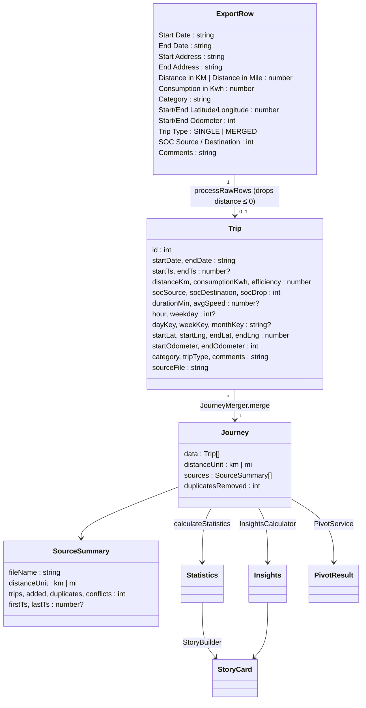

# Data model

```mermaid
classDiagram
    class ExportRow {
        Start Date : string
        End Date : string
        Start Address : string
        End Address : string
        Distance in KM | Distance in Mile : number
        Consumption in Kwh : number
        Category : string
        Start/End Latitude/Longitude : number
        Start/End Odometer : int
        Trip Type : SINGLE | MERGED
        SOC Source / Destination : int
        Comments : string
    }
    class Trip {
        id : int
        startDate, endDate : string
        startTs, endTs : number?
        distanceKm, consumptionKwh, efficiency : number
        socSource, socDestination, socDrop : int
        durationMin, avgSpeed : number?
        hour, weekday : int?
        dayKey, weekKey, monthKey : string?
        startLat, startLng, endLat, endLng : number
        startOdometer, endOdometer : int
        category, tripType, comments : string
        sourceFile : string
    }
    class Journey {
        data : Trip[]
        distanceUnit : km | mi
        sources : SourceSummary[]
        duplicatesRemoved : int
    }
    class SourceSummary {
        fileName : string
        distanceUnit : km | mi
        trips, added, duplicates, conflicts : int
        firstTs, lastTs : number?
    }
    class Statistics
    class Insights
    class StoryCard
    class PivotResult

    ExportRow "1" --> "0..1" Trip : processRawRows (drops distance ≤ 0)
    Trip "*" --> "1" Journey : JourneyMerger.merge
    Journey --> SourceSummary
    Journey --> Statistics : calculateStatistics
    Journey --> Insights : InsightsCalculator
    Statistics --> StoryCard : StoryBuilder
    Insights --> StoryCard
    Journey --> PivotResult : PivotService
```

Field-level detail: [DATA_MODEL.md](../DATA_MODEL.md).
