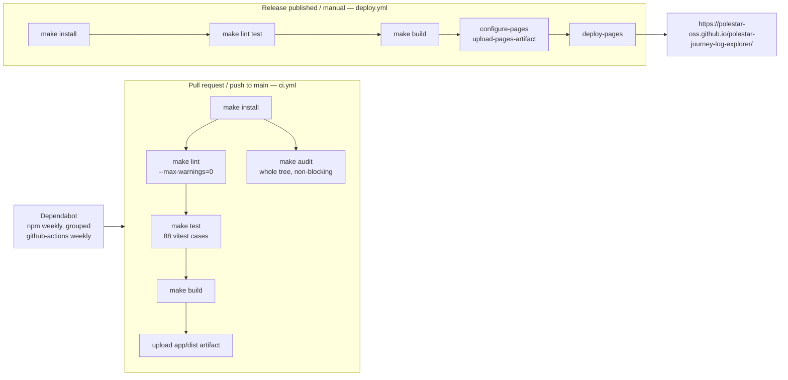

# Deployment and CI

- Node 22 in both workflows (Vite 7 does not run on Node 18).
- Every step is a Makefile target; running `make check` locally reproduces the
  pull-request gate.
- The site is static; the only runtime dependencies are tile servers.
