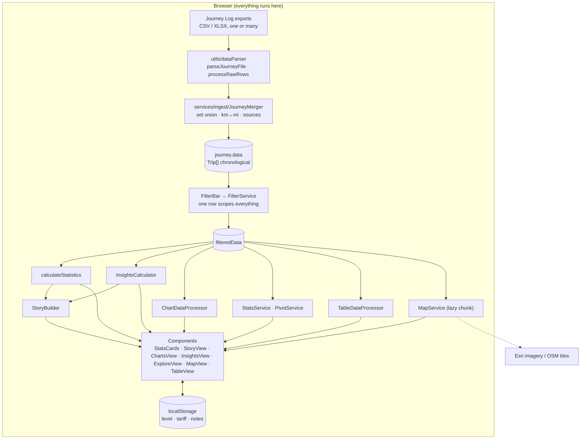

# System architecture

```mermaid
flowchart TB
    subgraph Browser["Browser (everything runs here)"]
        direction TB
        Files["Journey Log exports<br/>CSV / XLSX, one or many"]
        Parse["utils/dataParser<br/>parseJourneyFile · processRawRows"]
        Merge["services/ingest/JourneyMerger<br/>set union · km↔mi · sources"]
        Journey[("journey.data<br/>Trip[] chronological")]
        Filter["FilterBar → FilterService<br/>one row scopes everything"]
        Filtered[("filteredData")]
        Stats["calculateStatistics"]
        Insights["InsightsCalculator"]
        Charts["ChartDataProcessor"]
        Expert["StatsService · PivotService"]
        Story["StoryBuilder"]
        Table["TableDataProcessor"]
        Map["MapService (lazy chunk)"]
        UI["Components<br/>StatsCards · StoryView · ChartsView · InsightsView · ExploreView · MapView · TableView"]
        Prefs[("localStorage<br/>level · tariff · notes")]
    end
    Tiles["Esri imagery / OSM tiles"]

    Files --> Parse --> Merge --> Journey --> Filter --> Filtered
    Filtered --> Stats & Insights & Charts & Expert & Table & Map
    Stats & Insights --> Story
    Stats & Insights & Charts & Expert & Story & Table & Map --> UI
    UI <--> Prefs
    Map -.-> Tiles
```

No trip data leaves the browser. Dashed edges are the only network calls, and
neither carries trip data.
