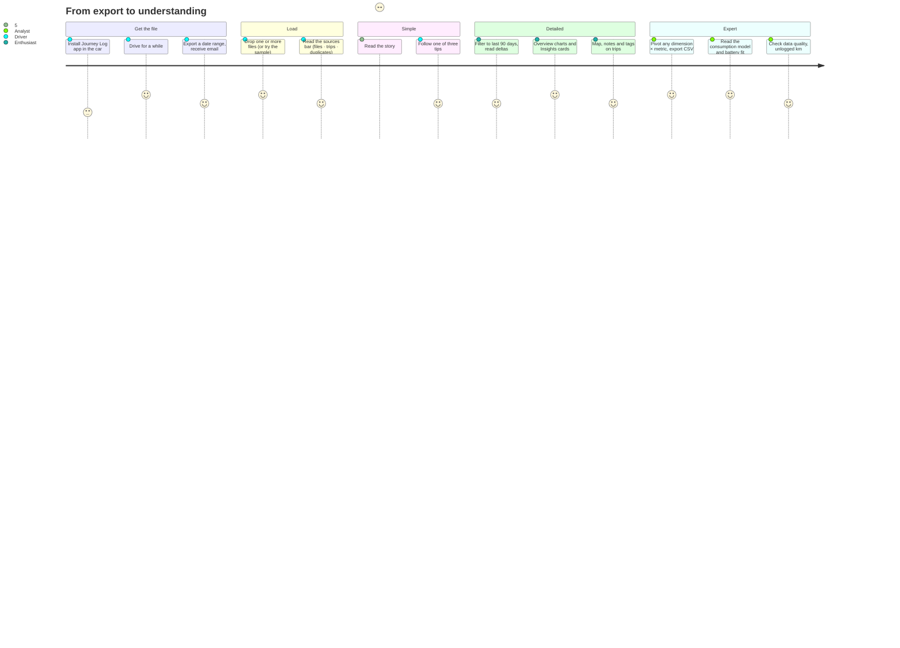
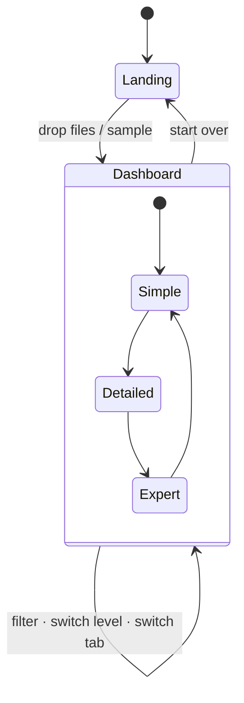

# User journey

```mermaid
journey
    title From export to understanding
    section Get the file
      Install Journey Log app in the car: 3: Driver
      Drive for a while: 5: Driver
      Export a date range, receive email: 4: Driver
    section Load
      Drop one or more files (or try the sample): 5: Driver
      Read the sources bar (files · trips · duplicates): 4: Driver
    section Simple
      Read the story: how far, energy, cost, range, winter: 5: Driver
      Follow one of three tips: 4: Driver
    section Detailed
      Filter to last 90 days, read deltas: 4: Enthusiast
      Overview charts and Insights cards: 5: Enthusiast
      Map, notes and tags on trips: 4: Enthusiast
    section Expert
      Pivot any dimension × metric, export CSV: 5: Analyst
      Read the consumption model and battery fit: 5: Analyst
      Check data quality, unlogged km: 4: Analyst
```

```mermaid
stateDiagram-v2
    [*] --> Landing
    Landing --> Dashboard : drop files / sample
    Dashboard --> Dashboard : add files (merge)
    Dashboard --> Dashboard : filter · switch level · switch tab
    Dashboard --> Landing : start over
    state Dashboard {
        [*] --> Simple
        Simple --> Detailed
        Detailed --> Expert
        Expert --> Simple
    }
```
